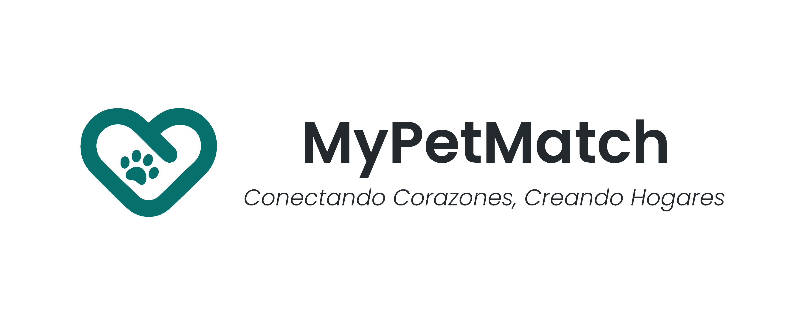
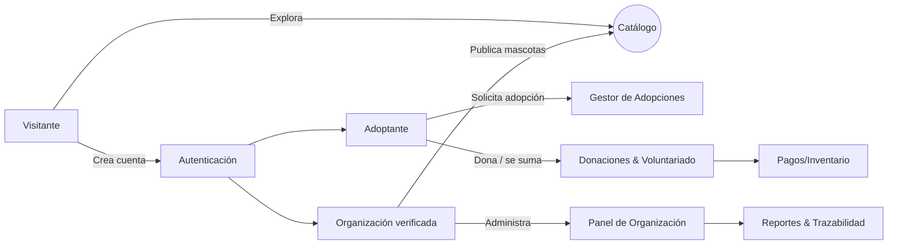

<div align="center">

# 🐾 MyPetMatch  

<div align="center">
  
</div>

[](#)
[](#)
[](#)
[](#)
[](#)

**Contacto del proyecto (Líder):** <a href="mailto:diedereicha@uamv.edu.ni">diedereicha@uamv.edu.ni</a>

</div>

> Plataforma web para la **adopción responsable**, el **apoyo a refugios** y la **movilización de voluntariado**, construida por **PhantomCoders** para el **Hackathon Nicaragua 2025**.

---

## 📌 Tabla de Contenido
- [🎯 Elevator Pitch](#-elevator-pitch)
- [❗ Problema y Solución](#-problema-y-solución)
- [💎 Propuesta de Valor](#-propuesta-de-valor)
- [✨ Características Clave](#-características-clave)
- [💼 Modelo de Negocio](#-modelo-de-negocio)
- [🎯 Público Objetivo y Buyer Personas](#-público-objetivo-y-buyer-personas)
- [📣 Objetivos de Marketing (SMART)](#-objetivos-de-marketing-smart)
- [🐾 Impacto Social & Métricas](#-impacto-social--métricas)
- [🧭 Valores](#-valores)
- [🎨 Marca & UI Kit](#-marca--ui-kit)
- [🛠️ Arquitectura & Stack](#-arquitectura--stack)
- [🧭 Navegación y Roles](#-navegación-y-roles)
- [⚙️ Instalación (Dev con Laragon)](#️-instalación-dev-con-laragon)
- [🗃️ Modelo de Datos (alto nivel)](#️-modelo-de-datos-alto-nivel)
- [🗺️ Roadmap](#-roadmap)
- [👥 Equipo & Roles](#-equipo--roles)
- [📎 Recursos](#-recursos)
- [📝 Licencia & Categoría](#-licencia--categoría)

---

## 🎯 Elevator Pitch
**MyPetMatch** es un **ecosistema digital** que une **refugios verificados**, **adoptantes responsables** y **voluntariado**, con procesos **rápidos, transparentes y trazables**. Más que listar mascotas, convertimos **historias** en **hogares**.

## ❗ Problema y Solución
**Dolores actuales**: refugios con recursos limitados, procesos lentos y fragmentados (WhatsApp/Excel), baja visibilidad y donaciones insuficientes.  
**Nuestra solución**: una plataforma **todo-en-uno** que **digitaliza** adopciones, **centraliza** donaciones e **impulsa** el voluntariado con confianza y transparencia.

## 💎 Propuesta de Valor
- **Plataforma tecnológica con corazón:** experiencias humanas e historias reales que motivan la adopción.  
- **Gestión integral para refugios:** panel centralizado para animales, solicitudes, donaciones y voluntarios.  
- **Confianza y trazabilidad:** perfiles verificados, procesos claros y comunicación guiada.

## ✨ Características Clave
- **Catálogo interactivo** con filtros avanzados y **perfiles que cuentan historias** (edad, tamaño, salud, temperamento, requisitos).  
- **Proceso de adopción digital**: rápido, seguro y transparente con seguimiento de estatus.  
- **Panel para organizaciones**: administración centralizada de animales, solicitudes, necesidades y reportes.  
- **Módulo de donaciones**: monetarias y en especie, con control e informes.  
- **Gestión de voluntariado**: oportunidades, postulaciones, horarios y recordatorios.  
- **Comunidad & eventos**: campañas, rescates y esterilizaciones para unir a la ciudadanía.

> _Mensajes clave:_ **Adopte, Apoye, Conecte.**

## 💼 Modelo de Negocio
- **Freemium para fundaciones** + **suscripción premium** para funciones avanzadas.  
- **Comisiones transparentes** sobre donaciones (la mayor parte siempre va al refugio).  
- **Publicidad ética y segmentada** (solo marcas alineadas al bienestar animal).  
- **Patrocinios corporativos** (alimento, veterinarias, seguros) para becar refugios y eventos.

## 🎯 Público Objetivo y Buyer Personas
**Público objetivo**  
- **Adoptantes (18–45)**: familias y personas que valoran un proceso digital, seguro y guiado.  
- **Organizaciones de rescate**: refugios/ONGs que desean optimizar adopciones, donaciones y voluntariado.

**Buyer Personas**
- **María – Adoptante primeriza (27, Managua)**: busca un perro sociable para apartamento. Necesita **claridad y confianza**. _Solución:_ filtros + proceso guiado + refugios verificados.  
- **Familia Herrera – Familia precavida (36–40)**: prioriza **seguridad y compatibilidad** con niños. _Solución:_ perfiles con temperamento e historial de salud + contacto directo con el refugio.  
- **Ana – Coordinadora de refugio (34)**: gestiona todo con pocos recursos y canales dispersos. _Solución:_ **panel único** que ahorra tiempo y da trazabilidad.

## 📣 Objetivos de Marketing (SMART)
- **10 refugios** integrados en **6 meses** mediante convenios y ferias.  
- **5,000 usuarios activos** en **9 meses** con campañas en redes, influencers *pet-friendly* y alianzas con clínicas.  
- **200 adopciones** concretadas en el **primer año**.

## 🐾 Impacto Social & Métricas
- **200+ mascotas** con hogar en 12 meses.  
- **100 voluntarios activos** en 6 meses.  
- Incremento en **donaciones y visibilidad** para organizaciones locales.

## 🧭 Valores
**Empatía · Responsabilidad · Comunidad · Integridad**  
Los valores son el corazón de cada decisión en MyPetMatch: respeto por la vida, adopción responsable, colaboración y transparencia total.

## 🎨 Marca & UI Kit
**Nombre y eslogan**: _MyPetMatch – Conectando Corazones, Creando Hogares_  

**Paleta principal**  
`#05706c` · `#f57952` · `#faefea` · `#23292c` · `#c9d1d9` · `#ffffff`  
**Avisos**: `#187056` · `#efa71d` · `#e03a2b`

<details>
  <summary>Ver moodboard e inspiración</summary>

  
</details>

---

## 🛠️ Arquitectura & Stack
- **Backend**: Laravel + Eloquent  
- **Frontend**: Blade + Tailwind CSS + Vite  
- **Auth & Roles**: login con **redirección por rol** (`adoptante`, `organizacion`, `admin`) y **middleware** por permisos.  
- **Assets**: `public/storage` (imágenes, logos, etc.).



## 🧭 Navegación y Roles
**Menú público**: Inicio · Nosotros · Cómo Funciona · Contacto · **Mi Área** (dinámico).  
**Subnavegación por rol**  
- **Organizaciones**: Resumen · Mascotas · Solicitudes  
- **Adoptantes**: Mi Área · Mis Solicitudes

---

## ⚙️ Instalación (Dev con Laragon)
> Entorno probado en **Laragon (Windows)** con **PHP 8.3**, **MySQL 8** y **Node 20+**.

```bash
# 1) Clonar el repo dentro de la carpeta de proyectos de Laragon
#    Ej.: C:\laragon\www\mypetmatch
git clone <repo> mypetmatch
cd mypetmatch

# 2) Variables de entorno
cp .env.example .env
# Configure DB_*, MAIL_* y APP_URL en .env (por ejemplo: http://mypetmatch.test)
php artisan key:generate

# 3) Dependencias
composer install
npm install

# 4) Migraciones y seeds
php artisan migrate --seed

# 5) Enlaces de storage
php artisan storage:link

# 6) Ejecutar
npm run dev         # compila assets con Vite
php artisan serve   # opcional; en Laragon puede usar http://mypetmatch.test
```

> **Nota**: Laragon soporta **Virtual Hosts** automáticos; nombre sugerido del proyecto: `mypetmatch.test`.

---

## 🗃️ Modelo de Datos (alto nivel)
- **users** (roles: adoptante/organizacion/admin, organization_id)  
- **organizations** (perfil verificado, necesidades)  
- **pets** (estado, salud, temperamento, requisitos)  
- **adoption_applications** (estatus, notas, historial)  
- **donations** (monetarias/en especie, registro y reportes)  
- **volunteer_opportunities** · **volunteer_applications**  
- **events** (campañas, ferias)

---

## 🗺️ Roadmap
- **MVP**: catálogo, solicitudes, panel de refugios, donaciones básicas.  
- **Siguiente**: perfil público de organizaciones, eventos/comunidad, reportes avanzados, patrocinios y auditoría de transparencia.

---

## 👥 Equipo & Roles
**PhantomCoders – Categoría Libre · Temática Social (Hackathon Nicaragua 2025)**  
- **Diedereich Alexander Alemán Martínez** — **Líder y Desarrollador**    
- **Diego Francisco Mora Castillo** — **Desarrollador**  
- **Jasmir Steven Galeano Mendoza** — **Marketing**  
- **Oliver Alexandro Hernández López** — **Diseño**  
- **Ashly Alejandrina Flores Cruz** — **Finanzas**  

- **Contacto del equipo** · 📧 <a href="mailto:diedereicha@uamv.edu.ni">diedereicha@uamv.edu.ni</a>

---

## 📎 Recursos
- **Logo** (PNG): `public/storage/MyPetMatchLogo-Transparente.png`  
- **Brand kit**: ver imágenes `public/storage/Paleta_De_Colores_MyPetMatch.png` y `public/storage/Moodboard.png`.

---

## 📝 Licencia & Categoría
Proyecto con fines **sociales y educativos** en el marco de **Hackathon Nicaragua 2025**.  
**Categoría:** Libre · **Temática:** Social.  
© PhantomCoders. Todos los derechos reservados.

---

<div align="center">
Hecho con ❤️ por PhantomCoders · <strong>Hackathon Nicaragua 2025</strong>
</div>
